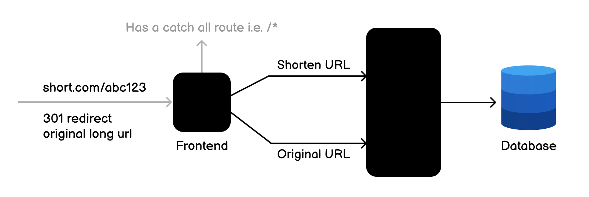

# URL-Shortening-Service-Using-Python

You are required to create a simple RESTful API that allows users to shorten long URLs. The API should provide endpoints to create, retrieve, update, and delete short URLs. It should also provide statistics on the number of times a short URL has been accessed.

	reate a RESTful API for a URL shortening service. The API should allow users to perform the following operations:

<ul>

	<li>Create a new short URL</li>
	<li>Retrieve an original URL from a short URL</li>
	<li>Update an existing short URL</li>
	<li>Delete an existing short URL</li>
	<li>Get statistics on the short URL (e.g., number of times accessed)</li>
</ul>

<h3>Demo of vedio</h3>

You can optionally setup a minimal frontend to interact with the API and setup redirects for the short URLs to the original URLs.

project Url : <a href="https://roadmap.sh/projects/url-shortening-service">link here</a>
